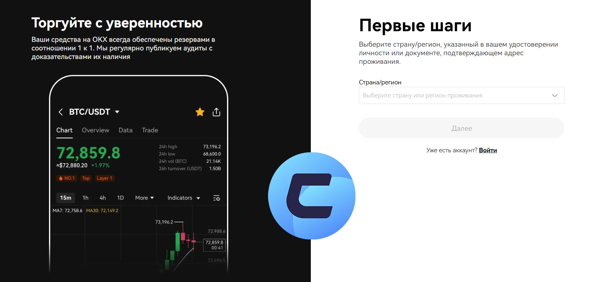

# 如何在OKX交易所注册：新手完整指南

---

想在加密货币市场分一杯羹？选对交易平台是第一步。OKX作为全球知名交易所，不仅提供丰富的交易品种，还有新人专属福利。本文手把手教你完成注册、身份认证，帮你快速开启加密货币投资之旅——从注册到开始交易，整个流程不超过10分钟。

---

## 为什么要在OKX注册账户

在OKX注册账户，你能获得什么？简单说，就是打开了加密货币世界的大门。

### 交易功能全覆盖

注册后，你可以：

- **现货交易**：直接买卖比特币、以太坊等主流币种，操作简单，适合新手入门
- **杠杆交易**：想用小资金撬动大收益？杠杆交易让你用借来的钱放大盈利空间（当然风险也会相应增加）
- **合约交易**：玩期货、期权这些衍生品，适合有经验的交易者，可以做多做空双向赚钱

### 躺赚机会也不少

- **质押挖矿**：把你的加密货币存进去，就能定期拿利息，像银行存款一样轻松
- **理财产品**：固定收益或灵活存取的理财方案任你选，闲置资金也能生钱

### 资产管理更安全

- **专属钱包**：平台提供加密货币钱包，你的资产存放在这里更安心
- **双重验证**：开启两步验证后，账户安全性翻倍，黑客想进来都难

### 新人福利拿到手软

- **注册奖励**：👉 [立即注册领取新人专属福利，邀请码62834398助你开启加密之旅](https://www.okx.com/join/62834398)
- **推荐返佣**：邀请朋友注册，你也能拿到奖励，躺着赚零花钱

### 学习资源随时看

- 不懂加密货币？平台有教程、市场分析工具，边学边赚
- K线图、技术指标这些专业工具都配齐了，帮你做出更明智的交易决策

### 参与新项目发售

- **IEO机会**：OKX定期上线新币首发，注册用户可以优先参与认购
- **DeFi和NFT**：想玩去中心化金融或数字藏品？这里都有

### 手续费省到极致

- 持有OKB代币（OKX平台币）能享受交易费折扣
- 新用户还有专属费率优惠，让你的每一笔交易都更划算

### 出入金很方便

- **充值**：支持加密货币转账或银行卡购买
- **提现**：随时把资产转到你的私人钱包

总之，注册OKX就是给自己在加密货币世界办了张通行证——交易、投资、学习、赚奖励，一个账户全搞定，安全性和便利性都有保障。

---

## OKX注册能拿到哪些奖励

在OKX注册不是白干活，平台给新用户准备了不少见面礼。

### 欢迎大礼包

- **注册即送**：完成账户创建就能领取加密货币或交易抵用券
- **首次充值奖励**：第一次往账户里打钱，平台按充值金额给你返现或额外加密货币

### 邀请好友双赢

- 通过邀请码注册或邀请别人注册，双方都能拿奖励
- 你邀请的人交易产生的手续费，你能分到一部分作为返佣

### 做任务领红包

- 新手任务清单：首次登录APP、完成第一笔充值、完成第一笔交易等，每完成一项就能解锁奖励
- 活跃奖励：交易量达到一定标准或使用特定产品（比如合约或质押），就能领取额外奖金

### 手续费打折

- 新用户前几个月可以享受交易手续费折扣
- 特定交易对有时会推出零手续费活动，省下的都是真金白银

### 参加比赛拿大奖

- 交易竞赛：比比谁的交易收益高,前几名能瓜分加密货币奖池
- 抽奖活动:注册后就有机会参与各种抽奖,奖品包括数字货币和其他福利

### 学习就能赚

- "边学边赚"项目:看完加密货币教程,答对测试题,就能领取奖励

这些奖励会根据地区和时间有所调整。想知道最新活动?直接上OKX官网看,或者关注他们的公告板块。

---

## 手把手教你注册OKX账户

注册OKX其实就是填几个框,发个验证码的事儿,不到5分钟搞定。

### 第1步:打开官网

1. 在浏览器输入OKX官网地址
2. 检查网址是否正确(防止进了钓鱼网站)

### 第2步:点注册按钮

1. 主页上找到"注册"按钮,点进去
2. 系统会跳转到账户创建页面

### 第3步:选择注册方式

**用邮箱注册:**

- 输入你的邮箱地址
- 设置一个强密码(大小写字母+数字+符号混着来,更安全)
- 有邀请码的话填上**62834398**,能领新人奖励

**用手机号注册:**

- 输入手机号(记得带上国家区号)
- 创建密码
- 填入邀请码**62834398**

**社交账号快捷注册:**

- 用Google或Apple ID登录,省去手动填资料的麻烦

### 第4步:验证身份

1. 填完信息后点"注册"
2. OKX会发验证码到你的邮箱或手机
3. 把验证码输进去,完成注册

### 第5步:设置安全措施

1. 注册成功后,系统会建议你开启两步验证(2FA)
2. 选择Google验证器、短信验证或其他方式来保护账户

### 第6步:身份认证(可选但推荐)

1. 进入个人中心的"身份认证"板块
2. 完成KYC认证能提高出入金额度,解锁更多功能
3. 按提示上传身份证件(护照、驾照或身份证)

### 第7步:充值开始交易

1. 认证完成后就能往账户充钱了
2. 进入"资产"页面,选择加密货币转账或银行卡购买
3. 👉 [充值完成,立即开始交易赚取收益](https://www.okx.com/join/62834398)

注册OKX为你打开了加密货币交易的大门。完成注册后,记得第一时间开启两步验证,有需要的话尽快完成身份认证——这样既安全又能享受平台所有功能。

---

## 如何在OKX完成身份认证(KYC)

在OKX完成KYC认证是提升账户安全和解锁高级功能的必要步骤。整个流程其实不复杂,准备好证件,十几分钟就能搞定。

### 第1步:登录你的账户

1. 打开OKX官网,用用户名和密码登录
2. 还没账号?先去注册一个

### 第2步:找到认证入口

1. 登录后,点右上角的头像图标
2. 下拉菜单里选"身份认证"

### 第3步:选认证等级

认证页面会显示几个等级:

- **Level 1**:基础认证,只需填基本信息
- **Level 2**:进阶认证,要上传身份证件
- **Level 3**:高级认证,适合大额交易用户或特定功能使用者

选一个你需要的等级开始

### 第4步:填个人信息

1. 输入全名、生日、家庭住址等信息(要和你证件上的一模一样)
2. 核对无误后点下一步

### 第5步:上传证件照片

1. Level 2认证需要选择证件类型:护照、驾驶证或身份证
2. 拍清楚或扫描证件正反面上传
3. 有时候平台还会要求上传地址证明(比如水电费账单或银行对账单)

### 第6步:自拍验证

1. 可能需要上传一张手持证件的自拍照
2. 确保脸和证件上的信息都清晰可见
3. 按屏幕提示拍照并上传

### 第7步:提交审核

1. 所有资料上传完毕后点"提交"
2. 审核时间从几分钟到几天不等,取决于系统繁忙程度

### 第8步:等结果通知

1. 审核结果会通过邮件或APP消息通知你
2. 认证通过后,账户等级会升级,出入金限额提高,更多功能也随之解锁

完成KYC认证不仅让你的账户更安全,还能享受OKX的全部服务。记住,提供准确信息和清晰证件照片能大大加快审核速度——别因为照片模糊或信息错误耽误时间。

---

---

## 总结

在OKX注册账户为你打开了加密货币交易和投资的完整生态。从现货交易到质押挖矿,从新人奖励到手续费折扣,OKX提供的不只是一个交易平台,更是一整套资产增值解决方案。完成注册和身份认证后,你就能享受安全、便捷、低成本的加密货币服务——这正是OKX适合新手和专业交易者的核心原因。[立即注册OKX,邀请码62834398,开启你的加密财富之旅](https://www.okx.com/join/62834398)。
